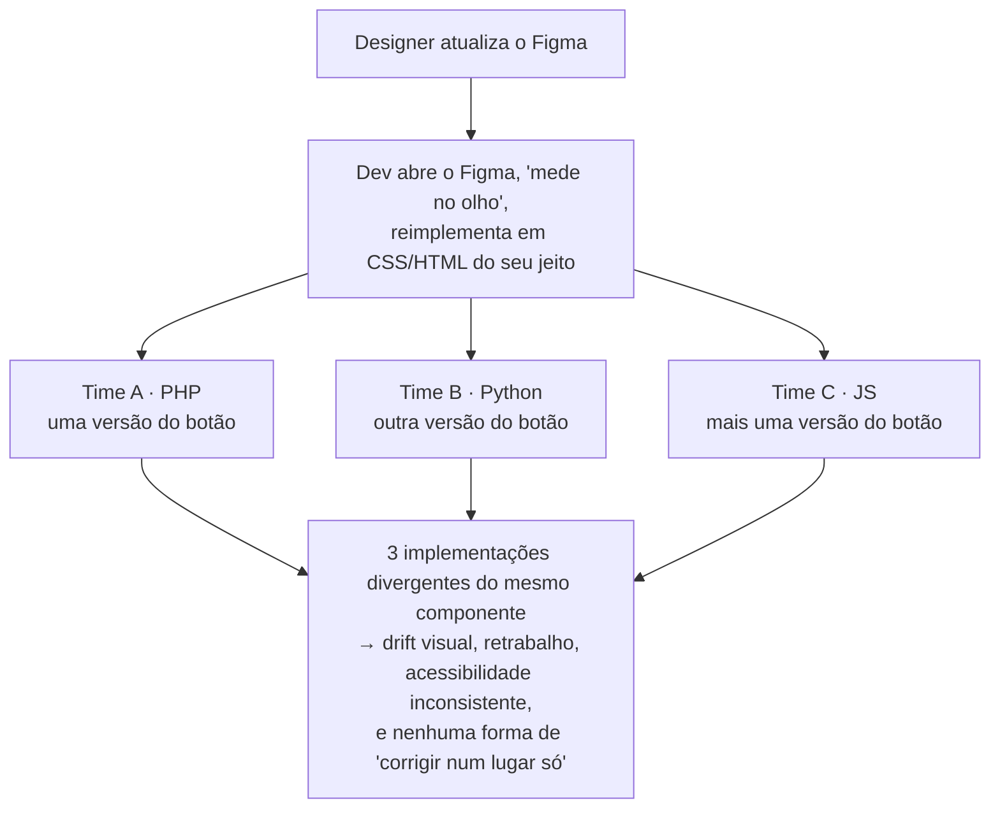

# 00 — Visão geral

## O problema

O DS-MS existe e é maduro **no design**: há paleta, tipografia, espaçamento, sombras, componentes (botão, input, busca, header/footer) e três breakpoints (Desktop 1440, Tablet 768, Mobile 360). Tudo isso vive no **Figma** e é explicado num **site de documentação que mostra imagens**.

O que **não** existe:

- Código consumível e versionado para os componentes.
- Uma fonte única que, ao mudar, propague a mudança para todos os produtos.
- Suporte explícito aos **diferentes stacks** dos times do estado (PHP, Python, JS).

## A dor (na prática)

## Objetivo

Estabelecer uma **fonte única de verdade (single source of truth)** que **gera** os artefatos de código para qualquer stack, com:

1. **Tokens** versionados e gerados a partir do Figma.
2. **Componentes** entregues de forma **agnóstica de framework**.
3. **Documentação viva** (Storybook) que substitui as imagens do site.
4. **Pipeline automatizado** (GitLab CI): mudou → testou (inclui acessibilidade) → publicou → consumidores sobem a versão.

## Escopo desta entrega

- **`docs/`** — este planejamento (pesquisa + arquitetura + ecossistema + fluxo + roadmap).
- **`poc/`** — prova de conceito rodável de **1 componente (button)** ponta-a-ponta.

Fora de escopo agora: migrar todos os componentes, publicar o pacote real no registry, e fazer o deploy do site. São fases do [roadmap](07-roadmap.md).

## Glossário

| Termo | Significado |
|---|---|
| **Design token** | Menor unidade de decisão de design (uma cor, um espaçamento, um raio) guardada como dado, não como código. |
| **Single source of truth** | Um único lugar de onde todas as plataformas derivam os valores. |
| **Style Dictionary** | Ferramenta (Amazon, open-source) que transforma tokens JSON em formatos por plataforma (CSS, SCSS, JS, PHP, Python…). |
| **Storybook** | Ambiente de documentação viva de componentes de UI. |
| **Web Component** | Elemento customizado padrão do navegador (`<ms-header>`) que roda em qualquer framework ou sem framework. |
| **W3C DTCG** | Formato padrão de arquivo para design tokens (Design Tokens Community Group). |
| **eMAG** | Modelo de Acessibilidade em Governo Eletrônico — padrão de acessibilidade obrigatório no governo brasileiro. |
| **Drift** | Divergência entre o design oficial e o que está implementado nos produtos. |
