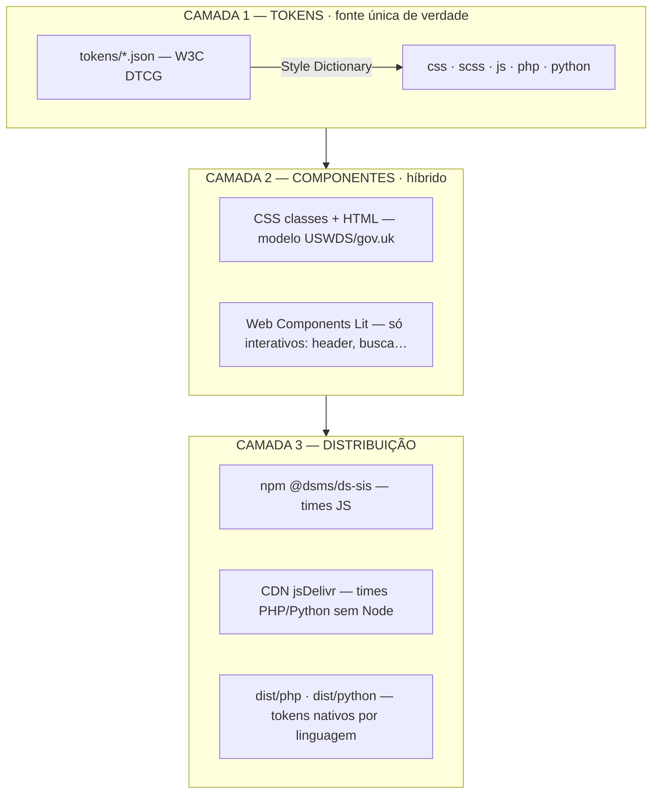

# 01 — Arquitetura (3 camadas)

A solução se organiza em três camadas independentes. Cada camada tem uma responsabilidade única e pode evoluir sem quebrar as outras.



## Camada 1 — Tokens

**Hoje:** `colors_and_type.css` define os tokens à mão em CSS custom properties. Funciona, mas só serve o CSS e não tem ligação automática com o Figma.

**Proposta:** os tokens passam a viver em **JSON no formato W3C DTCG** (`tokens/*.json`). O **Style Dictionary** lê esse JSON e gera, num único build, todas as saídas:

| Saída | Para quem |
|---|---|
| `dist/css/tokens.css` | Web (substitui o `:root` escrito à mão) |
| `dist/scss/_tokens.scss` | Times que usam Sass |
| `dist/js/tokens.js` + `.d.ts` | JS/TS, React, Web Components |
| `dist/php/Tokens.php` | Back-end PHP, temas WordPress |
| `dist/python/tokens.py` | Back-end Django/Flask, geração de templates |
| `dist/json/tokens.json` | Ferramentas e integrações |

**Origem dos tokens:** Figma → plugin **Tokens Studio** (ou export nativo de **Figma Variables**) → JSON → commit/PR no repositório. A partir daí o designer edita no Figma e o dev nunca mais "mede no olho".

> A POC já demonstra esse build: veja [`../poc/style-dictionary.config.js`](../poc/style-dictionary.config.js).

## Camada 2 — Componentes (modelo híbrido)

A decisão foi **híbrido**, pelo melhor custo/benefício para times multi-stack:

### a) CSS classes + HTML — para o grosso dos componentes
Modelo do [USWDS](https://designsystem.digital.gov/) e do [gov.uk](https://design-system.service.gov.uk/). Empacota o `components.css` que já existe + um markup canônico. Qualquer linguagem que renderiza HTML aplica a classe:

```html
<button class="btn btn-primary btn-md">Salvar</button>
```

- **Prós:** simples, zero runtime JS, funciona em PHP/Python/JS na hora.
- **Contra:** o markup é copiado pelo consumidor (mais verboso).

### b) Web Components (Lit) — só para os interativos
Componentes com comportamento (menu mobile, busca, overlay/modal) viram **custom elements**: `<ms-header>`, `<ms-search>`, `<ms-overlay>`. O markup e o comportamento ficam **centralizados** no elemento; o consumidor só cola a tag.

```html
<ms-header secretaria="SETDIG"></ms-header>
```

- **Prós:** "atualiza num lugar só" de verdade; padrão do navegador, sem lock-in.
- **Contra:** exige o `<script>` do bundle carregado.

> Referência de mercado para Web Components em design system: [Shoelace](https://shoelace.style/).

## Camada 3 — Distribuição

| Canal | Público | Como consome |
|---|---|---|
| **npm** `@dsms/ds-sis` | Times JS/React/Vue | `npm i @dsms/ds-sis` |
| **CDN** (jsDelivr/Pages) | Times PHP/Python sem Node | `<link>` do CSS + `<script>` dos Web Components |
| **Tokens por linguagem** | Back-ends e temas | importam `dist/php/Tokens.php` ou `dist/python/tokens.py` |

O nome `@dsms/ds-sis` e o import `@dsms/ds-sis/lib/styles.css` **já estão previstos** na documentação atual do projeto (`README.md` da raiz) — esta arquitetura concretiza o que já era a intenção.

Detalhes de consumo por linguagem em [04-multistack.md](04-multistack.md).
