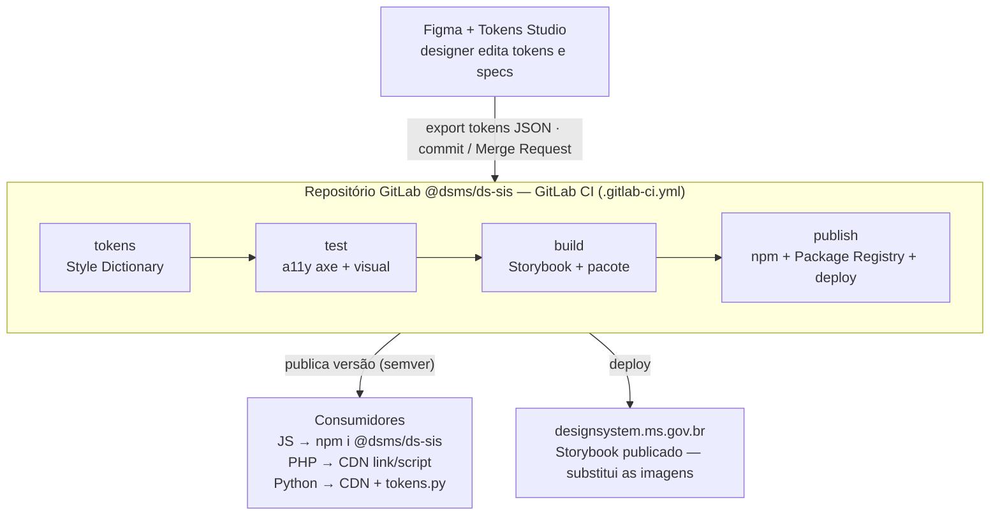

# 02 — Ecossistema e fluxo

## O fluxo completo (Figma → consumidores)

## Papéis

| Papel | Responsabilidade | Toca em |
|---|---|---|
| **Designer (SGD)** | Define tokens e specs no Figma; exporta o JSON. | Figma + Tokens Studio |
| **Mantenedor do DS (SETDIG)** | Revisa o MR, mantém componentes, versiona, publica. | Repositório GitLab |
| **CI (GitLab)** | Roda Style Dictionary, testes de acessibilidade, build e publish. Automático. | `.gitlab-ci.yml` |
| **Dev consumidor (times)** | Instala/atualiza a versão e usa os componentes no produto. | npm ou CDN |

## O princípio que resolve a dor

> **Uma mudança entra por um lugar (Figma/repo) e sai propagada para todos os produtos por versão.**

Quando um token muda (ex.: o azul institucional), o designer altera no Figma, o JSON é atualizado, o CI regenera **todas** as saídas (CSS, PHP, Python, JS) e publica uma nova versão. Cada time sobe a versão e recebe a mudança — sem reimplementar nada.

## Onde a automação entra

- **Style Dictionary** elimina a tradução manual de tokens para cada linguagem.
- **GitLab CI** elimina o build/test/publish manual.
- **Storybook + addon-a11y** elimina a documentação desatualizada e o teste de acessibilidade manual repetitivo.
- **Semver + Package Registry** dá rastreabilidade: cada produto sabe em qual versão do DS está.
