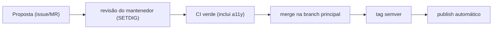

# 06 — Governança e acessibilidade

## Versionamento (Semantic Versioning)

O pacote `@design-system-ms/ds-sis` segue **semver** (`MAJOR.MINOR.PATCH`):

| Mudança | Incrementa | Exemplo |
|---|---|---|
| Quebra de contrato (renomeia classe/token, remove componente) | **MAJOR** | `1.4.2 → 2.0.0` |
| Novo componente/token sem quebrar o que existe | **MINOR** | `1.4.2 → 1.5.0` |
| Correção (ajuste de cor, bugfix de CSS) | **PATCH** | `1.4.2 → 1.4.3` |

Cada release tem **CHANGELOG** (o que mudou e por quê). Os times consomem por *range* (`^1.4.0`) e sobem MAJOR conscientemente.

## Modelo de contribuição

- Designers contribuem **tokens** via Figma/Tokens Studio (vira MR de JSON).
- Devs contribuem **componentes** via MR (CSS/HTML ou Web Component + story + docs + snippets).
- Nada é publicado sem passar pelo **gate de acessibilidade**.

## Acessibilidade — obrigação legal e gate técnico

Por ser um produto de **governo brasileiro**, a conformidade não é opcional:

- **eMAG** — Modelo de Acessibilidade em Governo Eletrônico (padrão do gov.br).
- **WCAG 2.1 nível AA** — base internacional referenciada pelo eMAG.

### Como o gate funciona

1. **Automático (CI):** `@storybook/addon-a11y` + `@storybook/test-runner` rodam **axe-core** em cada story. Violação = pipeline vermelho = não publica.
2. **Manual (por componente):** página de **testes de acessibilidade** nos moldes do [USWDS](https://designsystem.digital.gov/components/button/accessibility-tests/), cobrindo as 4 categorias:

| Categoria | Verifica | Ferramenta |
|---|---|---|
| Geral | Contraste (mín. 4.5:1 texto), tamanho de alvo, clareza | ANDI, Color Contrast Analyzer |
| Zoom | Funciona a 200% sem perder conteúdo/função | Navegador (Ctrl++) |
| Teclado | Tab navega, foco **visível**, sem armadilha | Teclado |
| Leitor de tela | Papel/estado anunciados (`button`, `disabled`) | NVDA, VoiceOver, Narrator |

> O `button.css` da POC já traz `:focus-visible` com `outline` de 2px e estado `disabled` com `aria-disabled` — pré-requisitos do gate.

## Métricas de saúde do DS (sugestão)

- **Adoção**: nº de produtos consumindo `@design-system-ms/ds-sis` e em qual versão (detecta produtos "presos" em versão antiga).
- **Cobertura de acessibilidade**: % de componentes com página de testes preenchida.
- **Drift**: nº de componentes reimplementados "por fora" (meta: zero).
